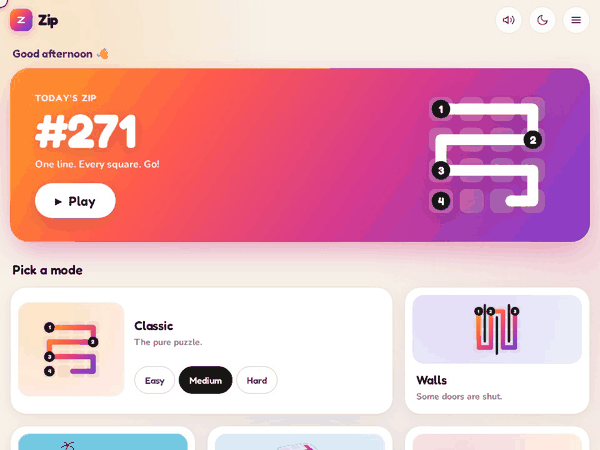
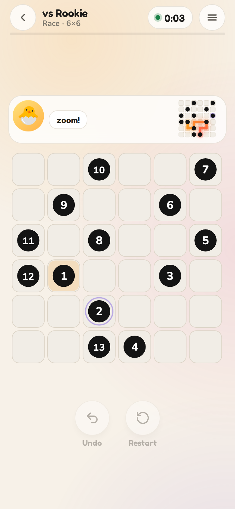
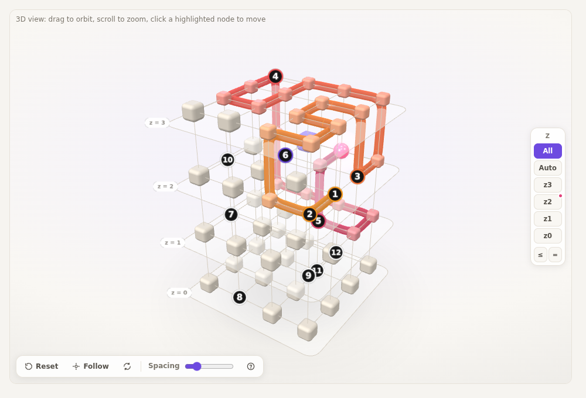

# AiZipSolve

[](https://github.com/ThVerg/AiZipSolve/actions/workflows/ci.yml)

LinkedIn's **Zip** puzzle — draw one line through every cell, passing the numbers in order —
generalised to **any graph**: classic grids, walls, islands joined by bridges, irregular shapes,
**3D cubes and 4D hypercubes**. Comes with a fun web game, a puzzle editor, an exact solver and
a graph-neural-network agent trained with imitation learning + reinforcement learning.

<p align="center">
  
</p>

<h3 align="center"><a href="https://thverg.github.io/AiZipSolve/">▶ Play online</a></h3>

- **Today's Zip** — a daily puzzle with streaks and best times.
- **Modes** — Classic (Easy / Medium / Hard), Walls, Islands, 3D Cube.
- **Race the robot** — Rookie 🐣, Scout 🦊 or Grandmaster 🦉 play the same puzzle beside you.
- **Show me 🤖** — the robot finishes the puzzle from wherever you are.
- **AI show** — watch a robot hit dead ends and back up; robot vs robot face-offs.

The online version is a static site (GitHub Pages): puzzles come from a curated bank of
unique-solution puzzles with pre-recorded robot runs (`zipsolve/app/static/bank/`), so it needs no
server. That includes the "more modes" (portals, wraparound, hex, triangles, one-way, overpass,
keys & doors, cube surface, fog, two-player co-op), the strategy robots' recorded runs in the AI
show (Detective, Sage, Evolver, Gambler, Mathematician), the Architect's designs and its weekly
challenge. Live robots on any puzzle, the Architect designing from scratch, the puzzle editor,
the AI workbench (live model, "AI vision" heat maps, custom options) and the training dashboard
need the local app.

## Run locally

```bash
pip install -e .            # Python 3.11+, CPU is fine
python -m zipsolve.app      # opens http://127.0.0.1:8000
```

Everything online plus: ☰ **Puzzle editor** (draw your own maps, check solvable / unique, save and
play), live robots on any puzzle in the **AI show** (`/lab`), the power-user **workbench**
(`/workbench`) and the **training dashboard** (`/dashboard`).

<p align="center">
  
  
</p>

Build the static site yourself with `python scripts/build_site.py` (standard library only; output in
`dist/`, deployed by `.github/workflows/pages.yml` on every push to `main`).

## How it works

Every variant is the same problem: a Hamiltonian path on a graph that visits checkpoints in
order. Grids, walls, islands, 3D and 4D are just different graph builders.

| Module | What it does |
|---|---|
| `zipsolve/graph.py`, `puzzle.py` | Graph + puzzle representation, validation, JSON |
| `zipsolve/generator.py` | Random solvable puzzles for every kind; unique-solution mode; organic islands the path crosses back and forth |
| `zipsolve/solver.py` | Exact iterative DFS with sound pruning (connectivity, dead ends, parity, articulation points, forced chains), solving from a prefix, move labelling |
| `zipsolve/rl/` | Gymnasium env, dimension-agnostic GNN policy/value net, PPO with curriculum + replay, imitation learning / DAgger from solver labels, frozen benchmark |
| `zipsolve/app/` | FastAPI backend + the game, lab, editor and dashboard pages |

### The agent

A message-passing GNN never sees coordinates, so one model plays 2D, islands, 3D and 4D.
Training pipeline (`scripts/pipeline_server.sh`):

1. Generate ~20k puzzles; the solver labels every legal move as win / lose / unknown.
2. Supervised pretraining on the winning-move sets (forced moves skipped).
3. DAgger: run the policy, label the positions where it goes wrong, retrain.
4. PPO fine-tuning over all puzzle families, best checkpoint picked on a held-out validation set.

Frozen validation set (240 puzzles, 16 families, 1 s budget):

| Method | Solved |
|---|---:|
| Exact solver | 98% |
| GNN, greedy (no backtracking) | 90% |
| GNN, best of 8 samples | 96% |
| GNN-guided solver search | 99% |

The best model (DAgger, 89% greedy on the test set) ships in `checkpoints/zip_gnn.pt`; the game's robots use it by default.

```bash
python -m zipsolve.rl.imitation generate --n 2000 --workers 8 --label-all --out data/ds.pkl
python -m zipsolve.rl.imitation train --data data/ds.pkl --out checkpoints/imit.pt
python -m zipsolve.rl.train --init checkpoints/imit.pt --minutes 60 --run-name ft
python -m zipsolve.rl.benchmark run --ckpt checkpoints/ft_best.pt --set val
```

## Dataset

**[FAVERG/zip-puzzles](https://huggingface.co/datasets/FAVERG/zip-puzzles)** on Hugging Face:
990k solvable puzzles with solutions across every family (2D 4–12, walls, masks, organic islands,
3D up to 6³, 4D up to 4⁴), with exact-solver difficulty stats and train / validation / test splits.

```python
from datasets import load_dataset
ds = load_dataset("FAVERG/zip-puzzles", "islands")
```

Rebuild it with `python scripts/build_hf_dataset.py --n 1000000 --workers 48`.

## Tests

```bash
pip install -e ".[dev]" && pytest -q
```

## License

MIT — see [LICENSE](LICENSE).
